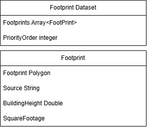
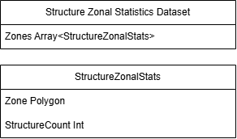
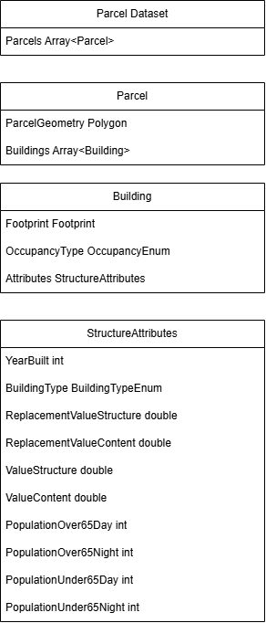
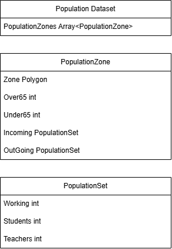

The NSI Generator will be rewritten to process standard data structures at major
processes within the workflow. It is anticipated that the raw base data is highly
variable so there will be processes to mutate raw data into the standard data
structures. In order to avoid large monolithic processes the data structures are
separated into three main components, population data, parcel data, and footprint
data. These three elements work together at various stages to produce a final
product but they can be described generally distinctly. Footprint data is
accompanied by a zonal statistics dataset, described below, which supports
structure placement where footprints are missing.

# A set of input footprint datasets

The input footprint dataset is a spatial dataset that has inputfootprint geometries
for structures. An input footprint dataset comes with a priority order that defines
which footprint dataset to use when multiple datasets have the same footprint in
the same geography. The set of input footprint datasets produce a footprint dataset
that represents the best of breed footprints. Within a footprint dataset a
footprint is expected to have a building height, a polygon, square footage based on
the polygon and a source. It is possible that two distinct processes will be
necessary - 1. combining based on priority, 2. assigning square footage and
building heights given missing data in the underlying input footprint dataset.

# A StructureZonalStatisticsDataset

This dataset is a polygon that represents a larger zonal space that has information
about expected total number of structures within that space independently derived
from the footprint records ideally. This dataset tracks at an aggregate spatial zone
the quantity of structures not represented by footprints but expected to be there
through other sources. The input to this process is a Footprint Dataset and a
polygon with expected structure counts. The StructureZonalStatisticsDataset tracks
the count of structures represented within a zone that are not accounted for by the
footprints themselves, which will indicate how many structures are anticipated to
fall back to parcel centroids or other means of placement within that zone.

# A fortified parcel dataset

A parcel dataset is a set of polygons that represent parcels of land with
attributes for a parcel. ParcelAttributes represent the minimum set of attributes
necessary for it to be a viable option in generation of a fortified parcel dataset.
A parcel dataset is joined with other spatial datasets that represent specialty
buildings like prisons, schools, hospitals, etc and are joined to create a
fortified parcel dataset. Since some of these alternative data elements help
describe location and population characteristics those attributes are added and are
stored for later processing, but they are optional in that many FortifiedParcels
will not have that information at this point.

# A population dataset

A population dataset is a set of population zones. A population zone is a polygon
that represents a larger zonal space (for example a census block or tract) that
carries the expected demographic composition of that space. Each zone tracks a
demographic split of its population: the count of residents over 65 and the count
under 65, since these cohorts carry different exposure profiles.

Each zone holds two population sets. The incoming population set is the population
allocated to the zone when the dataset is produced. The outgoing population set
tracks population drawn down from the zone as it is assigned to specific
structures. Keeping both sets on the zone allows the population assigned to
structures within a zone to be reconciled against the zone's expected counts.

A population set records the population categories that matter for exposure
modeling: working (typically derived from LEHD employment data), students, and
teachers. The students and teachers counts correspond to the specialty building
data (such as schools) that was joined into the fortified parcel dataset, so that
when a school structure is assigned population it draws its students and teachers
from the zone's population set.

In the workflow the population dataset is produced by the Distribute Population
process, which combines census population data, LEHD data, and the fortified
parcel dataset to allocate expected population counts across population zones. The
Assign Population process then consumes the population dataset together with the
point inventory to produce the populated point inventory, in which each structure
carries its assigned population.