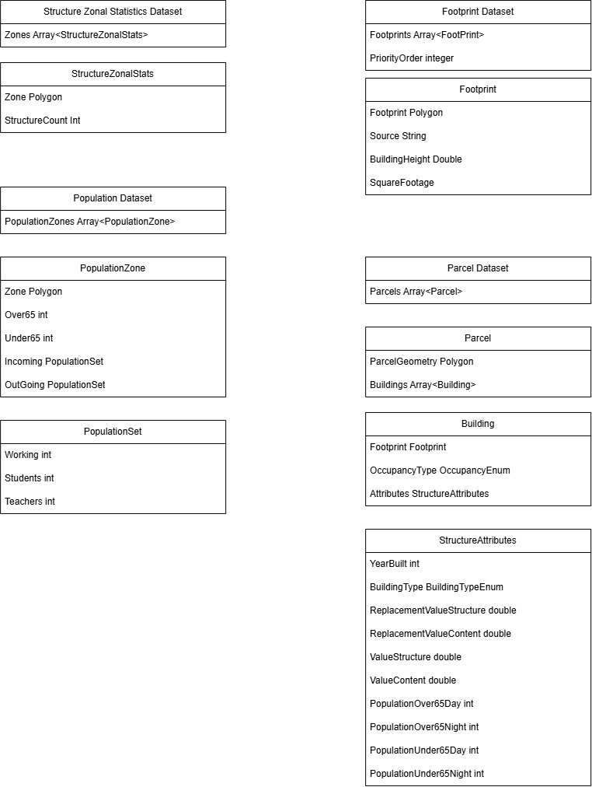

The NSI Generator will be rewritten to process standard data structures at major processes within the workflow. It is anticipated that the raw base data is highly variable so there will be processes to mutate raw data into the standard data structures. In order to avoid large monolithic processes the data structures are separated into three main components, population data, parcel data, and footprint data. These three elements work together at various stages to produce a final product but they can be described generally distinctly. 

# A set of input footprint datasets

The input footprint dataset is a spatial dataset that has inputfootprint geometries for structures. An input footprint dataset comes with a priority order that defines which footprint dataset to use when multiple datasets have the same footprint in the same geography. The set of input footprint datasets produce a footprint dataset that represents the best of breed footprints. Within a footprint dataset a footprint is expected to have a building height, a polygon, square footage based on the polygon and a source. It is possible that two distinct processes will be necessary - 1. combining based on priority, 2. assigning square footage and building heights given missing data in the underlying input footprint dataset.

# A StructureZonalStatisticsDataset

This dataset is a polygon that represents a larger zonal space that has information about expected total number of structures within that space independently derived from the footprint records ideally. This dataset tracks at an aggregate spatial zone the quantity of structures not represented by footprints but expected to be there through other sources. The input to this process is an Footprint Dataset and a polygon with expected structure counts. The StructureZonalStatisticsDataset tracks the count of structures represented within a zone that are not accounted for by the footprints themselves, which will indicate how many structures are anticipated to fall back to parcel centroids or other means of placement within that zone.
3. A fortified parcel dataset
4. A population dataset

 
 
