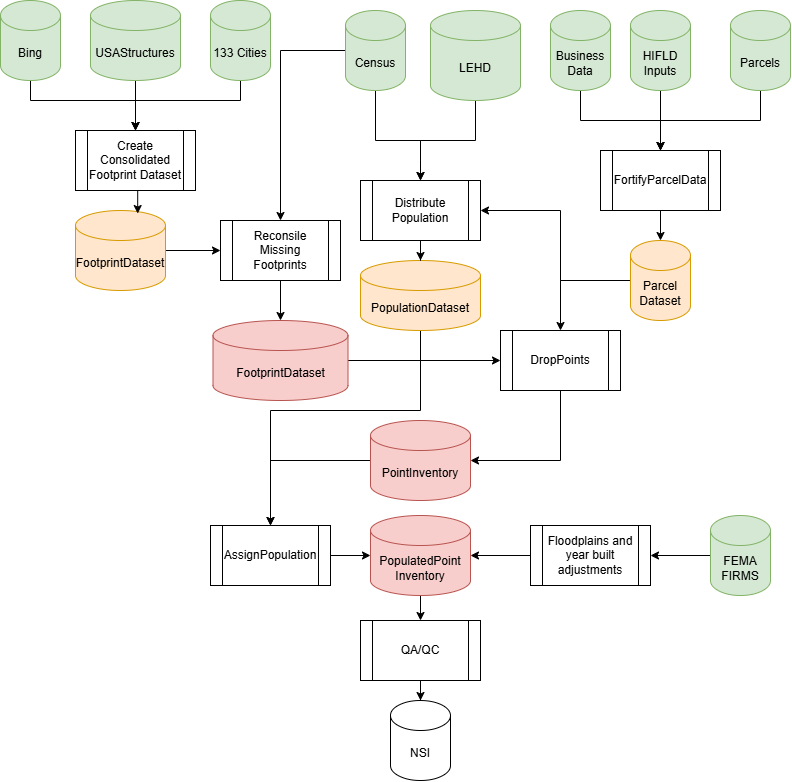

# Workflow
The basic workflow takes primary inputs and converts them into standardized data formats.

# Process primary input datasets
Many primary data inputs are needed for the base NSI data, however, other processes may have less primary data to work through so these steps may not be possible. In those cases skipping this to get to a later step may need to be an external workflow to create the next layer input data.

## create consolidated footprint dataset
Multiple input footprint data sources may exist, the input footprint datasets are consolidated to the Footprint dataset that represents the best footprint for each structure across the dataset.

## distribute population
The census data and the LEHD data work together to generate a base population dataset. This is amended ultimately with the fortified parcel data that has population characteristics on the per parcel dataset leveraging things like schools, hospitals and prisons.

## fortify parcel data
The input parcel data is joined with auxiliary datasets like schools and prisons and hospitals to assign the appropriate information into the parcel dataset including an optional point geometry representing the point location and various population and type characteristics.

# process secondary input datasets
After the base data has been normalized and prepared for the next set of processing the following processes will occur

## Reconcile missing footprints
The US Census has a set of zonal statistics to represent the expected number of structures, when we have more footprints than structures or less footprints than structures this process keeps track of the shortage or surplus so that points can be placed at a later step according to the appropriate assumptions for the parcel types available. 

## Drop Points
Consuming the zonal statistics, the footprint dataset, and the fortified parcel data the parcel dataset is converted to a point based representation of buildings with standardized outputs. 

# process final data
The intermediate data of a population dataset and a set of point based structures with standard attributes are then combined to create a first pass populatedpoint inventory.

## Assign population
Population is assigned to structures based on their type and the types of population in the population dataset, if information in the point invenotry such as students and teachers or hospital workers is present those values are reconciled and the remaining population is distributed to the remaining structures within that population region.

## floodplains and year built
Based on the NFIP dataset and the default year built in the populated point inventory the floodzones are applied and the year built is evaluated to make any adjustments necessary to assumptions about special attributes like foundation type or height.

# QA/QC Final datasets
qa/qc is applied, issues are traced to the appropriate intermediate step and processes are adjusted to fix items that need fixin.
